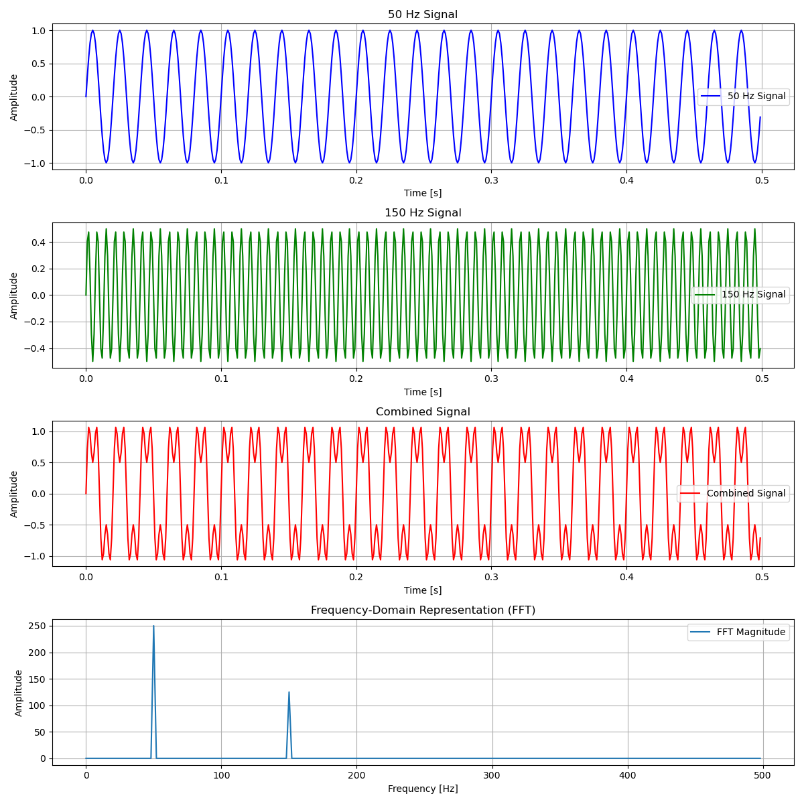

## Fast Fourier Transform Overview

The Fast Fourier Transform, otherwise known as FFT is arguably the most beautiful and functional algorithm to have been discovered with numerous applications in modern technology.
The Fourier matrix is a cornerstone of the whole technology of digital signal processing. 
The utilization of the Fourier matrix is the Discrete Fourier Transform (DFT) and its inverse which is a technique to analyze and transform discrete signals or sequences from the time domain into the frequency domain with a computational complexity of $(O(N^2))$. 
With the implementation of FFT the computational of the DFT will be reduced from $(O(N^2))$ to an almost linear $O(NlogN)$.

The FFT is widely used in various fields, including:

- **Signal Processing**: Filtering, noise reduction, and compression of signals.

- **Audio Processing**: Spectrum analysis, equalization, and sound synthesis.

- **Image Processing**: Image compression, filtering, and image reconstruction.

- **Communications**: Modulation and demodulation of signals, channel estimation, and error detection and correction.

- **Numerical Methods**: Solving partial differential equations and polynomial multiplication.

My interest in the FFT and its utilization of DFT is rooted in my experience in FPGA development and the applications of Digital Signal Processing (DSP) which has been enabled and accelerated with the applications of FFT implemented on an FPGA. Below is a step-by-step on how to solve a simplified signal sequence.

## Steps-By-Step solving the FFT

Consider a simple problem where we have a time-domain signal $c = (1, 2, 3, 4)$. We want to transform this signal into its frequency-domain representation using the FFT.

### Step-by-Step FFT Calculation

1. **Split into Even-Odd**:
    - Rearrange the input sequence in $c^\prime$ and $C^"$ in the format of $c = (x0, x2, x1, x3)$. For $c = (1, 2, 3, 4)$, this becomes $(1, 3, 2, 4)$.

2. **Divide and Conquer** (Radix-2 FFT):
    - Split the sequence into even-indexed: $(x0, x2)$ and odd-indexed elements: $(x1, x3)$
        - Even-indexed: $(1, 3)$
        - Odd-indexed: $(2, 4)$
    - Compute the DFT of each smaller sequence using the following format:
        - $X[0] = x[0] + x[1]$
        - $X[1] = x[0] - x[1]$
            - For $(1, 2)$: 
                - $X_{\text{even}}[0] = 1 + 3 = 4$ 
                - $X_{\text{even}}[1] = 1 - 3 = -2$
                - $X_{\text{even}} = (4, -2)$

            - For $(3, 4)$: 
                - $X_{\text{odd}}[0] = 2 + 4 = 6$ 
                - $X_{\text{odd}}[1] = 2 - 4 = -2$
                - $X_{\text{odd}} = (6, -2)$

3. **Combine**:
    - Combine the results using the FFT algorithm utilizing each smaller sequence:
        - For $( k = 0, 1, \ldots, \frac{N}{2} - 1 )$:
            - $X[k] = X_{\text{even}}[k] + W_N^k \cdot X_{\text{odd}}[k]$
            - $X[k + N/2] = X_{\text{even}}[k] - W_N^k \cdot X_{\text{odd}}[k]$
        - where:
            - $( W_N^k = e^{-i \frac{2 \pi k}{N}} )$ is the twiddle factor
        - Combine the results using the twiddle factors:
            - For \( N = 4 \), the twiddle factors are:
                - $W_4^0 = e^{-i \frac{2 \pi \cdot 0}{4}} = 1$
                - $W_4^1 = e^{-i \frac{2 \pi \cdot 1}{4}} = e^{-i \frac{\pi}{2}} = -i$
            - Combine the results to get the final 4-point FFT:
                - $X[0] = X_{\text{even}}[0] + W_4^0 \cdot X_{\text{odd}}[0] = 4 + 1 \cdot 6 = 10$
                - $X[1] = X_{\text{even}}[1] + W_4^1 \cdot X_{\text{odd}}[1] = -2 + (-i) \cdot (-2) = -2 + 2i$
                - $X[2] = X_{\text{even}}[0] - W_4^0 \cdot X_{\text{odd}}[0] = 4 - 1 \cdot 6 = -2$
                - $X[3] = X_{\text{even}}[1] - W_4^1 \cdot X_{\text{odd}}[1] = -2 - (-i) \cdot (-2) = -2 - 2i$

**Final Result**

    - X = {10, -2 + 2i, -2, -2 - 2i}

## Results and Analysis

The FFT of $c = (1, 2, 3, 4)$ is $X = (10, -2 + 2i, -2, -2 - 2i)$. This transformation reveals the frequency components of the original signal. The result indicates that the signal's primary component is a DC term (10), with additional complex frequency components. 

### What It Means

The FFT efficiently decomposes the time-domain signal into its constituent frequencies, demonstrating the power of the algorithm. This ability to transform and analyze signals is crucial in various applications, from audio processing to communications, where understanding the frequency components of a signal can lead to better compression, filtering, and interpretation.

For one final example on the next page, an application of the FFT was represented in terms of audio spectrum analysis and how it can be utilized for noise filtering. A script was implemented, to sum up a 50 Hz and a 150 Hz together. The combined signal is represented in the third waveform. Although looking different than the first two signals, the FFT can decompose the two signals, identifying the original signal frequency. Once identified, these two signals can be amplified or filtered out as needed. The frequency-domain representation is a key component to sound mixing, filtering out any undesired frequencies, making the music, and allowing the tech to mix the audio for any listeners effectively.

